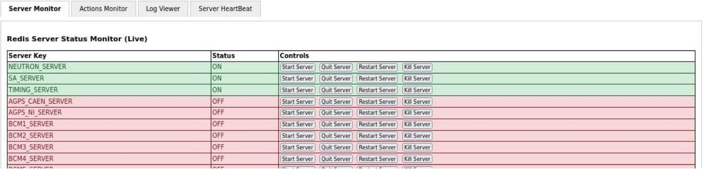
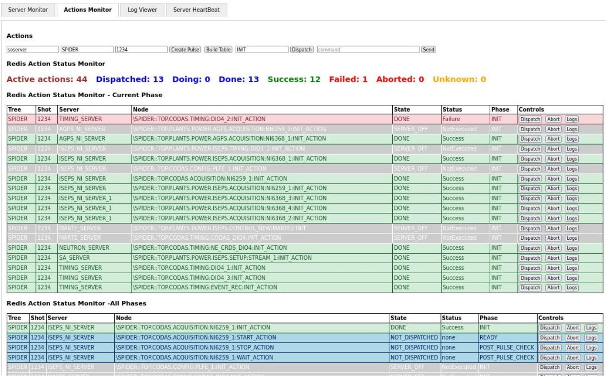

RedisActionDispatcher
===
New distributed implementation of MDSplus dispatcher based on REDIS
---
<br>
This is a new implementation of the MDSplus action dispatcher based on Redis. The new implementation is written entirely in Python and uses Redis as a communication medium between the central dispatcher and the action servers. The dispatcher carries out the overall synchronization, ensuring that sequential actions are executed in the proper sequence (per server instance) and dependent actions are executed when their associated condition is met. The server class name is passed as an argument to action servers in addition to a unique ID number (usually set to 1). It is, in fact, possible to launch more than one action server per server class to carry out parallel execution of actions with the same server class. Action servers will carry out the assigned tasks and notify the dispatcher via Redis when the action has terminated. Pending actions can be aborted, actions can be redispatched manually, and the associated terminal output is captured and saved in Redis so that it can be later visualized (see the Web interface description).<br>
Action servers are monitored by the dispatcher via heartbeat Redis messages so that the dispatcher can detect any server crash.  
<br><br>
To launch the action dispatcher: <br>

```
python action_dispatcher.py [redis server]
```
Where redis server is the IP address of the machine hosting the Redis server. If not defined, localhost is assumed <br><br>
To launch an action server: <br>

```
  python action_server.py <server_class> <server_id> <redis_server>
```
  
Any number of action servers can be launched in a distributed system, provided that the redis_server argument points to the same IP (the machine hosting the Redis server). <br>
Once a dispatcher and a set of servers have been launched, it is possible to interact with the system via the following command: <br>

```
python dispatcher_commands.py <redis_sever> <command>
```
where command is one of the following:

-  **quit**: quit dispatcher
- **abort**: abort the current sequence
- **create_pulse <tree> <shot>**: create a new pulse file
- **build_tables**: create dispatch tables for the current pulse file (defined by create_pulse)
- **do_phase <phase>**: execute the actions defined for the specified phase
- **server_restart <server class> <server id>**: abort pending actions and restart server
- **server_abort <server class> <server id> <action path>**: abort specified actions for the specified server
- **server_stop <server class> <server id>**: stop server (after finishing pending actions)
- **server_quit <server class> <server id>**: abrupt quit server
- **print_pending**: let the dispatcher print pending action (for debug purpose)

It is possible to display the terminal output during execution for a given action server and possibly a given action:

```
 python display_logs.py <tree> <shot> <server class> <action full path> <redis server>
```
where the action full path refers to the path in the tree of the target action. If ANY is specified, then the terminal output of all actions for that server class is displayed during execution.
<br><br>
# Web interface
Even if it is possible to interact with the action dispatcher via program dispatcher_commands.py, the preferred interface is web-based. 
<br>
The web application provides real-time visibility and control over distributed actions and servers using a Redis-backed architecture.

It is intended for:

* System operators
* Developers
* Engineers overseeing MDSPlus Redis Dispatcher automated processes

---

## Main Tabs Overview

| Tab                  | Purpose                                                                                                          |
| -------------------- | --------------------------------------------------------------------------------------------------------------- |
| **Server Monitor**   | View the real-time status (ON/OFF) of all active servers and perform basic server actions.                      |
| **Actions Monitor**  | Monitor action status by tree/shot and dispatch or abort actions.                                               |
| **Log Viewer**       | Submit log messages manually for testing and stream live logs from the server log file (for debug purposes).    |
| **Server HeartBeat** | View the latest heartbeat activity timestamp for each server (to check action server health).                              |

---

## Server Monitor

The **Server Monitor** tab provides:

* Live status of all servers registered in Redis 
* Server status display (`ON` / `OFF`)
* Server control buttons:

  * `Start Server` to launch a new action server
  * `Quit Server` to quit an action server by sending it a quit command
  * `Restart Server` kill and relaunch an action server
  * `Kill Server` to kill the process running an action server
* Automatic updates of server information
* Priority sorting where active (`ON`) servers appear first

### Notes

* The control buttons `Start Server`, `Restart Server` and `Kill Server` refer to project-specific actions, i. e., depending on how and where the action servers are launched in the specific project environment. Therefore, these operations are carried out by the Web interface by invoking a generic shell script:

```
sh server_command.sh {server_class} {command}   
```
where command can be either START or RESTART or KILL. It is therefore sufficient to provide such a shell script to adapt the Web interface to the specific project application. 

## Actions Monitor

The **Actions Monitor** tab displays two tables:

1. **Active Actions** (the actions based on `Current Phase`)
2. **All Actions** (all the declared actions, regardless of phase)

### Action Information

Each row includes:

* Tree
* Shot
* Server
* Node
* State (NOT_DISPATCHED, DISPATCHED, DOING, DONE, ABORTED, SERVER_OFF)
* Status (Success/Failure)
* Phase

The color of a given action row summarizes its current state:


| Color  | Meaning           |
| ------ | ----------------- |
| Blue   | Not Dispatched    |
| Green  | Success           |
| Red    | Failed or Aborted |
| Orange | In Progress       |
| Grey   | Server Off        |

### Available Actions

Each action row supports the following operations:

* `Dispatch` to redispatch the selected action
* `Abort` to abort the execution of the selected action
* `Logs` to display in a new Window the terminal output issued during the execution of the selected action

Note that the **Logs** button accesses the latest action log information stored in Redis.

### Additional Features

* The Action Monitor tab presents a top row for configuring the interface and manually driving the dispatcher. The meaning of the fields is:
  * Address of the Redis server (required)
  * Experiment Name (required)
  * Shot number (required when using the following buttons to drive the dispatcher) 
  * Create Pulse button: to create a new pulse based on the experiment name and shot
  * Build Table button: to build the internal dispatcher tables (required before starting the execution of the phases)
  * Name of the phase to execute
  * Dispatch button: to dispatch the phase defined in the previous field
  * Custom commands (debug)

It is possible, therefore, to operate the sequence entirely from the Web interface. This is, however, not the case in common use cases, where the sequence is coordinated by an external tool (such as the main state machine supervising the experiment sequence). In this case, the external tool will interact with the dispatcher via dispatcher_command.py, and the Web interface passively displays the current state. In this case, only the two initial fields of the first row of the Action Monitor tab (Redis server and Experiment name) must be defined.  

### Live Summary

A live summary displays:

* Total actions
* Categorized status counts

Failed and aborted actions are displayed first.

---

## Log Viewer (for debug)
The **Log Viewer** tab provides:

* Submission of custom log messages for testing
* Live streaming of the `redis_pubsub.log` file
* Auto-scrolling log updates


---

## Server Heartbeat (for debug)

The **Server Heartbeat** tab:

* Displays the latest known heartbeat timestamp for each server
* Updates when receiving messages from:


## Starting the Web Server

Install the required dependencies:

```bash
pip install gunicorn gevent
```

Launch the web server using:

```bash
gunicorn -w 5 -k gevent --keep-alive 3600 --timeout 0 -b 0.0.0.0:5000 dispatcher_webmonitor:app
```

## Gunicorn Options

| Option                      | Description                                          |
| --------------------------- | ---------------------------------------------------- |
| `-w 5`                      | Start 5 worker processes                             |
| `-k gevent`                 | Use the Gevent worker class for asynchronous support |
| `--keep-alive 3600`         | Keep connections alive for up to 3600 seconds        |
| `--timeout 0`               | Disable worker timeout                               |
| `-b 0.0.0.0:5000`           | Bind the server to all interfaces on port 5000       |
| `dispatcher_webmonitor:app` | Python module and Flask app instance to serve        |

---
